# Zefrik

Soy estudiante de Ingeniería en Software.

Mi lenguaje principal actualmente es **Python**, y mi experiencia llega por ahora hasta el uso de **clases, objetos y estructura básica de proyectos**.

Gran parte de mis repositorios documentan proyectos que desarrollé anteriormente durante la **preparatoria usando C++ y Arduino**, los cuales he reconstruido y documentado como parte de mi aprendizaje y portafolio.

También experimento ocasionalmente con **JavaScript**, principalmente por curiosidad y aprendizaje personal.

---

## Qué suelo desarrollar

- Automatización y pequeños proyectos usando **Python**
- Prototipos con **Arduino UNO y Arduino Nano**
- Integración de **sensores, servos y buzzers** para sistemas físicos simples
- Documentación de proyectos de electrónica desarrollados previamente en **C++**

---

## Tipo de repositorios que publico

No todos mis repositorios están enfocados únicamente en código.

En muchos casos también subo proyectos que documentan:

- ideas generales de programación
- pequeños experimentos
- técnicas personales de aprendizaje
- explicaciones simples de conceptos que voy entendiendo

La intención es **registrar mi progreso y compartir lo que voy aprendiendo**.

---

## Proyectos destacados

### Arduino Access Control System
Sistema de control de acceso con **keypad, pantalla LCD, LEDs y servo**.  
Fue uno de mis proyectos más completos durante la preparatoria.

### TMP36 Temperature Alert
Sistema simple de **alarma de temperatura** usando un sensor **TMP36** y un buzzer.

### Traffic Light
Simulación básica de un **semáforo con Arduino UNO usando tres LEDs**.

---

## Tecnologías que uso

**Principal**

- Python

**Electrónica / Embebidos**

- Arduino UNO
- Arduino Nano
- C++

**Aprendiendo**

- JavaScript

---

## Objetivo de este perfil

Este perfil funciona como un registro de aprendizaje donde voy subiendo:

- proyectos que construyo
- reconstrucciones de proyectos antiguos
- experimentos
- documentación de ideas y técnicas

El objetivo es **seguir aprendiendo y construir un portafolio técnico con el tiempo**.
